# Pet Tracker — Frontend Technical & Visual UI Manual

<p align="center">
  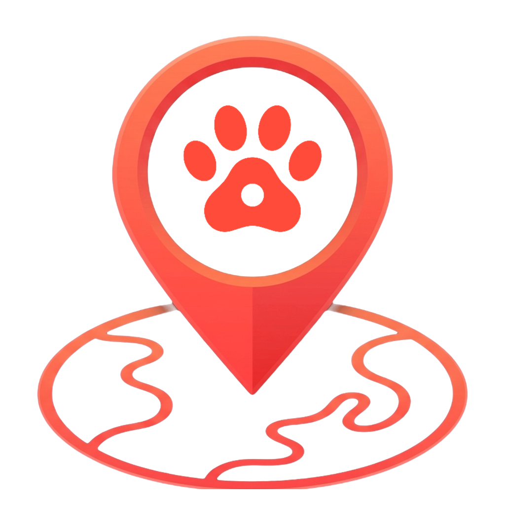
</p>

> **Application Name:** `Pet Tracker` (`pet-tracker-app`)  
> **Live Web App & API (Vercel):** [https://pet-tracker-backend-gamma.vercel.app/](https://pet-tracker-backend-gamma.vercel.app/)  
> **Framework:** Flutter (Dart SDK `^3.12.2`)  
> **State Management & Routing:** GetX (`get: ^4.7.3`)  
> **Target Platforms:** Android, iOS, Web (PWA), Windows, macOS, Linux  
> **Map Engine:** `flutter_map` (OpenStreetMap) + OSRM Road Snapping  
> **Authentication & Session Persistence:** Custom JWT Bearer Auth + `shared_preferences` persistent login  
> **Push & Local Notifications:** `firebase_messaging` (`16.7.0`) + `flutter_local_notifications` (`22.3.1`)

---

## Table of Contents
1. [System Overview & Core Capabilities](#1-system-overview--core-capabilities)
2. [Project Structure & Code Organization](#2-project-structure--code-organization)
3. [Design System, Branding & Responsive Theme](#3-design-system-branding--responsive-theme)
4. [Visual UI Specifications & Screen-by-Screen User Manual](#4-visual-ui-specifications--screen-by-screen-user-manual)
   - [4.1 Landing Screen & 10-Second Animated Hero Carousel](#41-landing-screen--10-second-animated-hero-carousel)
   - [4.2 Login Credentials Form & Persistent Session](#42-login-credentials-form--persistent-session)
   - [4.3 Account Registration (`Create Account`)](#43-account-registration-create-account)
   - [4.4 Home Dashboard (`HomeScreen`)](#44-home-dashboard-homescreen)
   - [4.5 Live GPS Map Tracking & Custom Pet Photo Marker](#45-live-gps-map-tracking--custom-pet-photo-marker)
   - [4.6 Location History Trail & Collapsible Floating Pet Card](#46-location-history-trail--collapsible-floating-pet-card)
   - [4.7 Dedicated Full-Screen Map Focus Setup (`MapFocusScreen`)](#47-dedicated-full-screen-map-focus-setup-mapfocusscreen)
   - [4.8 Pet Management (`My Pet`, `Add/Edit Pet` with Photo Upload, `Pet Details`)](#48-pet-management-my-pet-addedit-pet-with-photo-upload-pet-details)
   - [4.9 Safe Zone Geo-Fencing & Full-Screen Interactive Map Editor](#49-safe-zone-geo-fencing--full-screen-interactive-map-editor)
   - [4.10 Collar Management, Tracker Details & Assign Pet Workflow](#410-collar-management-tracker-details--assign-pet-workflow)
   - [4.11 ESP32 Hardware Wi-Fi Setup (`DeviceWifiSetupScreen`)](#411-esp32-hardware-wi-fi-setup-devicewifisetupscreen)
   - [4.12 Activity Status & Real-Time Alerts Inbox (`AlertsScreen`)](#412-activity-status--real-time-alerts-inbox-alertsscreen)
   - [4.13 Account Menu & Explicit Sign-Out (`ProfileScreen`)](#413-account-menu--explicit-sign-out-profilescreen)
5. [Core Technical Architecture & Services](#5-core-technical-architecture--services)
6. [Setup, Building & Deployment Guide](#6-setup-building--deployment-guide)

---

## 1. System Overview & Core Capabilities

**Pet Tracker** is a modern, cross-platform Flutter application (Android, iOS, and Web) designed for pet owners to monitor their pets in real time using ESP32 GPS tracking collars.

### Key Highlights
- **Custom Transparent App Icon & Unified Branding:** Features a custom coral-red 3D GPS pin with an embedded 4-toe paw print and safe-zone trail base on a 100% transparent background across Android launcher icons, Web browser favicons, PWA manifests, and in-app headers under the unified name **"Pet Tracker"**.
- **10-Second Animated Hero Carousel on Landing:** Welcomes users with a 4-card auto-advancing feature showcase (`Live GPS Tracking`, `Smart Safe Zones`, `Location History & Daily Routes`, `Battery & Hardware Alerts`) while keeping email/password fields hidden until **Login** is tapped.
- **Persistent Login Across App Restarts:** Automatically persists the user's JWT session token in `SharedPreferences`. Closing or restarting the app bypasses the login screen and boots directly into the Home Dashboard until the user explicitly clicks **Log Out**.
- **Live Map with Jumping Pet Photo Marker & Collapsible Header:** Displays the pet's uploaded photo inside a circular map pin that gently bounces when new GPS coordinates arrive. Includes a single-row status header and a minimize/maximize toggle chevron so the card never blocks the map.
- **Historical Trail & Waypoints:** Toggling from **Live** to **History** renders the pet's past route polyline, directional paw prints along the path, and numbered waypoint markers while keeping the Live view clean.
- **Dedicated Full-Screen Editors for Safe Zones & Map Focus:** Both **Create/Edit Safe Zone** (`/geofence-form`) and **Setup Focus Map** (`/map-focus`) are full-screen interactive map workflows (rather than cramped modals), complete with a one-tap **"Sync with Map Focus"** button.
- **Direct Pet Photo Upload (Gallery & Camera):** Supports picking or taking a pet photo directly from the device (`image_picker`), encoding it as a lightweight data URL so it syncs across Android and Web without external bucket configuration.
- **High-Priority Native Phone Push Notifications:** Integrates Firebase Cloud Messaging (`firebase_messaging`) with `flutter_local_notifications` and Android channel `pet_tracker_alerts` (`Importance.max`) to trigger system tray pop-up banners, sound, and vibration even when the phone is locked.

---

## 2. Project Structure & Code Organization

```text
pet-tracker-app/
├── assets/
│   └── images/
│       └── app_icon.png                  # Custom transparent-background Pet Tracker icon
├── lib/
│   ├── app/
│   │   ├── bindings/
│   │   │   └── initial_binding.dart      # GetX dependency injection (Repositories, Controllers)
│   │   ├── routes/
│   │   │   ├── app_pages.dart            # Page routing definitions (GetPage)
│   │   │   └── app_routes.dart           # Static route constants (/login, /home, /geofence-form, etc.)
│   │   └── theme/
│   │       └── app_theme.dart            # Adaptive Material 3 Light & Dark themes
│   ├── core/
│   │   ├── api/
│   │   │   ├── api_client.dart           # HTTP client with persistent JWT token & caching
│   │   │   └── api_exception.dart        # Strongly-typed API error representation
│   │   ├── constants/
│   │   │   └── app_config.dart           # Backend URL resolver (defaults to Vercel production URL)
│   │   ├── services/
│   │   │   └── notification_service.dart # Web-safe FCM + Local Notification channel dispatcher
│   │   ├── utils/
│   │   │   └── navigation_args.dart      # Helper types for cross-screen arguments
│   │   └── widgets/
│   │       ├── app_scaffold.dart         # Responsive shell with AppBar icon & floating bottom nav
│   │       └── pet_avatar.dart           # Resilient avatar supporting data URLs, network, & fallback
│   ├── data/
│   │   ├── models/
│   │   │   └── models.dart               # Typed data models & JSON parsers
│   │   └── repositories/
│   │       └── repositories.dart         # Repository layer communicating with FastAPI
│   ├── features/
│   │   ├── alerts/
│   │   │   └── views/alerts_screen.dart          # Activity Status & Safety Alerts inbox
│   │   ├── auth/
│   │   │   ├── controllers/auth_controller.dart  # Persistent auth session & login/register logic
│   │   │   └── views/
│   │   │       ├── login_screen.dart             # 4-card 10s carousel hero + expandable login form
│   │   │       └── register_screen.dart          # Account registration screen
│   │   ├── devices/
│   │   │   └── views/
│   │   │       ├── devices_screen.dart           # Collar Management list
│   │   │       ├── device_details_screen.dart    # Hardware status & Assign Pet workflow
│   │   │       └── device_wifi_setup_screen.dart # High-contrast ESP32 Wi-Fi setup screen
│   │   ├── geofences/
│   │   │   └── views/
│   │   │       ├── geofences_screen.dart         # Safe Zone list & instant toggle switches
│   │   │       └── geofence_form_screen.dart     # Full-screen Safe Zone map editor & radius preview
│   │   ├── home/
│   │   │   ├── controllers/app_data_controller.dart # Shared reactive state & saved map focus
│   │   │   └── views/home_screen.dart            # Central dashboard with Pet Hero Card & Quick Actions
│   │   ├── pets/
│   │   │   └── views/
│   │   │       ├── pets_screen.dart              # My Pet list with photo avatars & status badges
│   │   │       ├── pet_details_screen.dart       # Pet profile, linked collar, & quick actions
│   │   │       └── pet_form_screen.dart          # Create/Edit Pet with Gallery & Camera photo upload
│   │   ├── profile/
│   │   │   └── views/profile_screen.dart         # Account summary & Log Out button
│   │   └── tracking/
│   │       ├── controllers/tracking_controller.dart # Live polling, history trail, & focus state
│   │       └── views/
│   │           ├── tracking_screen.dart          # Interactive map, collapsible pet card, & trail
│   │           └── map_focus_screen.dart         # Full-screen interactive Map Focus setup
│   ├── firebase_options.dart             # Platform-specific Firebase configuration
│   └── main.dart                         # Entrypoint, web-safe Firebase init, & AuthGate
└── web/
    ├── favicon.png                       # Custom transparent browser tab icon
    ├── index.html                        # Web entrypoint titled "Pet Tracker"
    └── manifest.json                     # PWA manifest named "Pet Tracker"
```

---

## 3. Design System, Branding & Responsive Theme

Defined in [`lib/app/theme/app_theme.dart`](../pet-tracker-app/lib/app/theme/app_theme.dart), the UI automatically adapts to **Light Mode** and **Dark Mode** (`ThemeMode.system`) and scales containers/modals dynamically based on screen dimensions (`MediaQuery.sizeOf(context)`).

| Token / Element | Light Theme Value | Dark Theme Value | Usage |
| :--- | :--- | :--- | :--- |
| **Brand Emerald (`AppTheme.green`)** | `#12B96A` | `#12B96A` | Primary actions, active toggles, safe status, map accents |
| **Alert Coral (`AppTheme.orange`)** | `#FF5B1D` | `#FF5B1D` | Offline badges, safe-zone exit warnings, trail polylines, sign-out |
| **Dark Slate (`AppTheme.darkCard`)** | `#0F172A` | `#0F172A` | High-contrast hero cards and secondary action buttons |
| **Scaffold Background** | `#F4F7FA` | `#0B1120` | Clean outdoor-readable page canvas |
| **Card Surface** | `#FFFFFF` | `#1E293B` | Elevated rounded containers (`24px–28px` radius) with subtle `1px` borders |
| **Typography** | `#0F172A` (Primary) / `#475569` (Muted) | `#F8FAFC` (Primary) / `#94A3B8` (Muted) | High-contrast weights (`w600–w900`) for clear legibility |

---

## 4. Visual UI Specifications & Screen-by-Screen User Manual

### 4.1 Landing Screen & 10-Second Animated Hero Carousel
**File:** [`lib/features/auth/views/login_screen.dart`](../pet-tracker-app/lib/features/auth/views/login_screen.dart)

<p align="center">
  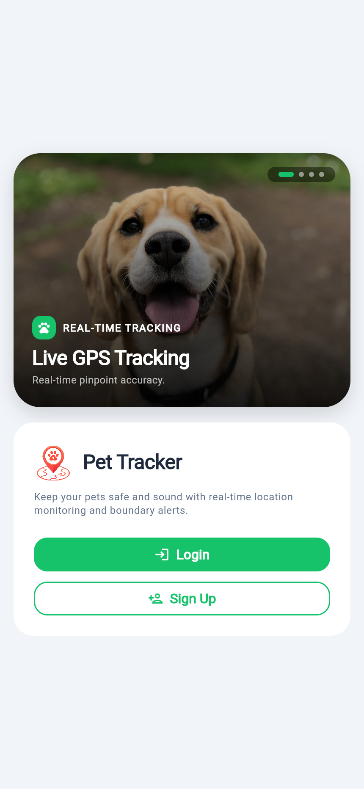
</p>

#### UI Specifications & Manual
- **4-Card Auto-Rotating Hero Carousel:** Above the welcome card, a rounded `PageView` carousel (`borderRadius: 32px`) automatically transitions every **10 seconds** (`Curves.easeInOutCubic`) and also supports manual horizontal swiping:
  1. **REAL-TIME TRACKING — Live GPS Tracking:** *"Real-time pinpoint accuracy."*
  2. **GEO-FENCING — Smart Safe Zones:** *"Instant boundary alerts."*
  3. **ACTIVITY & TRAILS — Location History & Daily Routes:** *"Walk trails and adventure waypoints."*
  4. **DEVICE STATUS — Battery & Hardware Alerts:** *"Device telemetry and low battery warnings."*
- **Pill Dot Indicators:** Top-right floating badge displays animated progress dots indicating the active slide.
- **Clean Initial Landing State:** Email and password inputs are **hidden by default** when opening the app. Only the custom **Pet Tracker** icon, welcome message, **Login** button, and **Sign Up** button are shown.

---

### 4.2 Login Credentials Form & Persistent Session
**File:** [`lib/features/auth/views/login_screen.dart`](../pet-tracker-app/lib/features/auth/views/login_screen.dart) & [`lib/features/auth/controllers/auth_controller.dart`](../pet-tracker-app/lib/features/auth/controllers/auth_controller.dart)

<p align="center">
  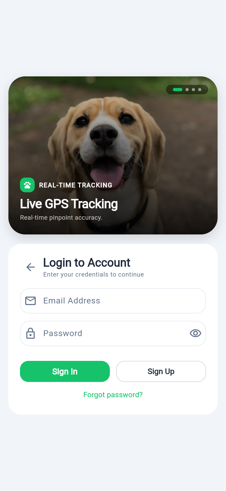
</p>

#### UI Specifications & Manual
- **Smooth Expand Transition:** Tapping **Login** on the landing card triggers an `AnimatedCrossFade` (`350ms`) into the **Login to Account** form while keeping the 4-card hero carousel visible above.
- **Controls:**
  - **Back Arrow (`←`):** Collapses the credential fields back to the initial landing card.
  - **Email Address & Password Fields:** High-contrast rounded inputs with visibility toggle (`👁`) on the password field.
  - **Sign In / Sign Up / Forgot Password:** Submits credentials to `POST /api/v1/auth/login`.
- **Persistent Login Behavior:** Once signed in, `ApiClient` saves the JWT token to `SharedPreferences` (`pet_tracker_jwt_token`). Closing or restarting the app restores the session in `AuthController.onInit()` and goes straight to the **Home Dashboard** without showing the login screen again until **Log Out** is pressed.

---

### 4.3 Account Registration (`Create Account`)
**File:** [`lib/features/auth/views/register_screen.dart`](../pet-tracker-app/lib/features/auth/views/register_screen.dart)

<p align="center">
  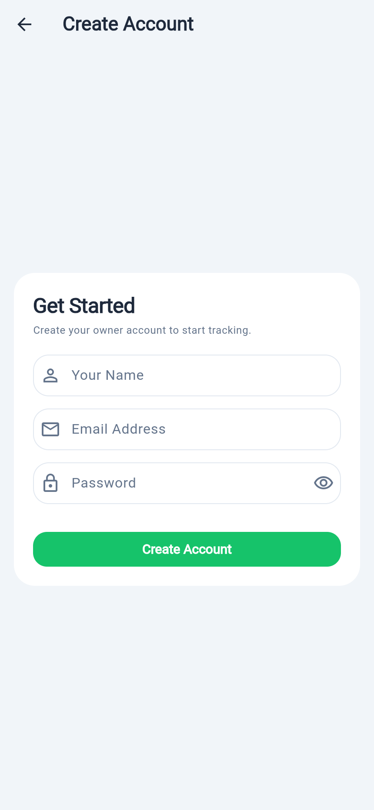
</p>

#### UI Specifications & Manual
- **Workflow:** Accessible via the **Sign Up** button on the landing or login card.
- **Fields:** Collects **Your Name**, **Email Address**, and **Password** (with show/hide toggle) and registers the account via `POST /api/v1/auth/register`, immediately logging the new owner into the dashboard.

---

### 4.4 Home Dashboard (`HomeScreen`)
**File:** [`lib/features/home/views/home_screen.dart`](../pet-tracker-app/lib/features/home/views/home_screen.dart)

<p align="center">
  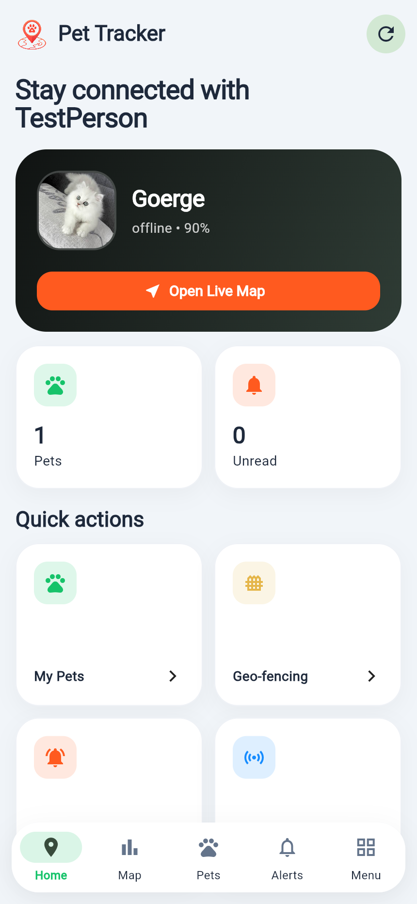
</p>

#### UI Specifications & Manual
- **Top AppBar:** Displays the custom transparent **Pet Tracker** icon, title, and a tonal **Refresh (`↻`)** button to sync all pets, collars, safe zones, and alerts.
- **Pet Hero Card:** Dark high-contrast card displaying:
  - The selected pet's **uploaded photo** (`Goerge`), name, live collar status (`online` / `offline`), and battery percentage (`90%`).
  - A full-width vibrant **Open Live Map** button that jumps directly to the pet's live GPS coordinates.
- **Summary Metric Cards:** Side-by-side cards showing total registered **Pets** (`1`) and **Unread** alerts (`0`).
- **Quick Actions Grid:** Responsive 2-column (mobile) / 4-column (tablet/web) grid providing one-tap access to **My Pets**, **Geo-fencing**, **Alerts**, and **Collars**.
- **Floating Bottom Navigation Bar:** Capsule-shaped navigation dock with 5 tabs: **Home**, **Map**, **Pets**, **Alerts**, and **Menu**.

---

### 4.5 Live GPS Map Tracking & Custom Pet Photo Marker
**File:** [`lib/features/tracking/views/tracking_screen.dart`](../pet-tracker-app/lib/features/tracking/views/tracking_screen.dart)

<p align="center">
  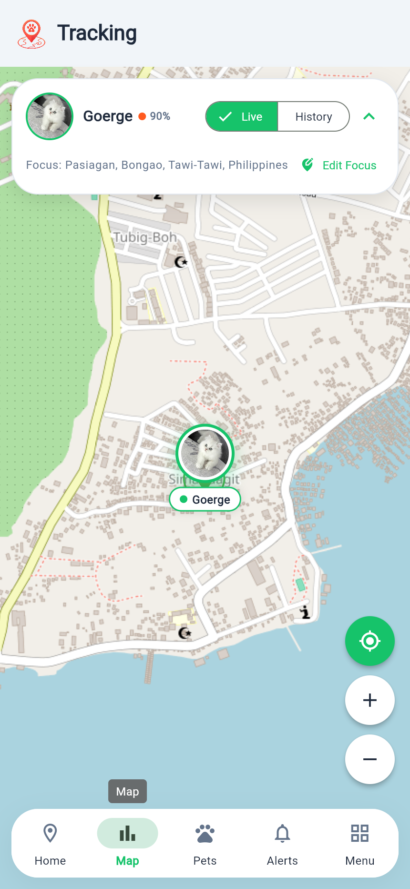
</p>

#### UI Specifications & Manual
- **Live Mode (Clean Real-Time View):** In **Live** mode, only the pet's current location marker and active safe-zone circles are shown on the OpenStreetMap canvas (historical trails are hidden to keep the live view uncluttered).
- **Custom Pet Photo Marker with Jumping Animation:**
  - Instead of a generic pin, the pet's **actual uploaded photo** (`Goerge`) is rendered inside a circular green-bordered badge with a name pill (`• Goerge`) beneath it.
  - Whenever a new GPS telemetry update arrives from the collar, `_JumpingPetMarker` performs a smooth vertical bounce animation so the owner visually notices live movement.
- **Single-Row Pet Header:** In the top floating card, the pet avatar, pet name (`Goerge`), status dot, battery percentage (`90%`), **Live / History** segmented toggle, and collapse chevron (`^`) are aligned cleanly in a **single horizontal row**.

---

### 4.6 Location History Trail & Collapsible Floating Pet Card
**File:** [`lib/features/tracking/views/tracking_screen.dart`](../pet-tracker-app/lib/features/tracking/views/tracking_screen.dart)

<p align="center">
  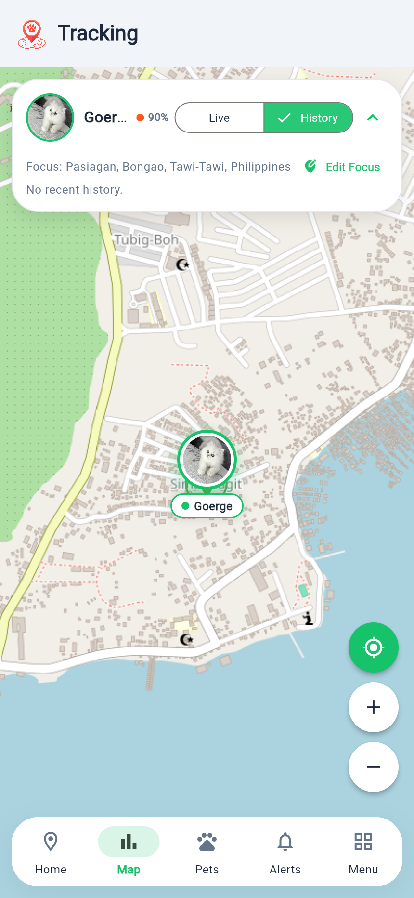
  &nbsp;&nbsp;&nbsp;
  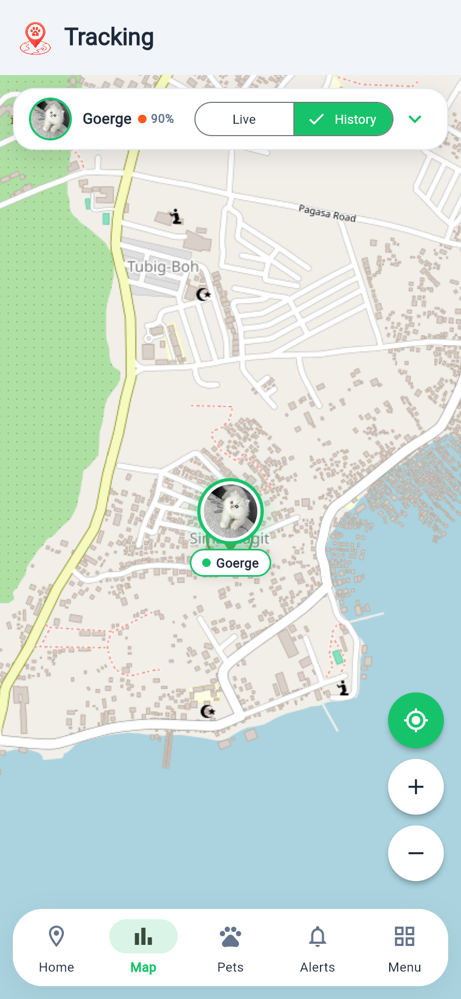
</p>

#### UI Specifications & Manual
- **History Mode (Left):** Tapping **History** beside **Live** fetches recorded telemetry points (`GET /api/v1/pets/{id}/location-history`) and overlays:
  - An orange route **polyline** connecting historical coordinates.
  - **Directional paw prints** rotated along the bearing of each segment.
  - **Numbered circular waypoint badges** (`1`, `2`, `3`...) and a blue start flag (`⚑`) marking previous locations.
- **Minimize / Maximize Floating Card (Right):** Tapping the chevron button (`^` / `v`) on the right side of the floating pet card collapses the secondary focus/status rows into a compact single-row bar so the card never obstructs the map view.
- **Floating Map Controls:** Bottom-right circular buttons allow one-tap **Recenter (`⌖`)**, **Zoom In (`+`)**, and **Zoom Out (`-`)**.

---

### 4.7 Dedicated Full-Screen Map Focus Setup (`MapFocusScreen`)
**File:** [`lib/features/tracking/views/map_focus_screen.dart`](../pet-tracker-app/lib/features/tracking/views/map_focus_screen.dart)

<p align="center">
  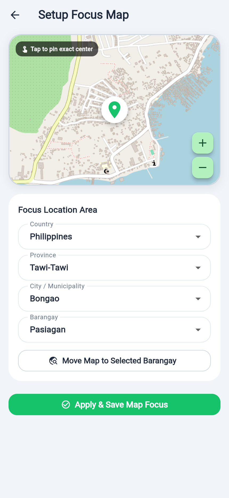
</p>

#### UI Specifications & Manual
- **Full-Screen Map Workflow:** Accessible via **Edit Focus** on the Tracking screen (or the initial **Setup Focus Map** prompt). Implemented as a dedicated full screen (`/map-focus`) rather than a modal popup.
- **Interactive Map Pinning:** Users can tap anywhere on the interactive map preview at the top to pin the exact center coordinate, or use zoom controls (`+` / `-`) to inspect streets.
- **Hierarchical Location Selector:** Supports selecting **Country** (`Philippines`) $\rightarrow$ **Province** (`Tawi-Tawi`) $\rightarrow$ **City / Municipality** (`Bongao`) $\rightarrow$ **Barangay** (`Pasiagan` / `Simandagit`), with a **Move Map to Selected Barangay** button to automatically geocode and pan the map.
- **Persistence:** Tapping **Apply & Save Map Focus** saves the focus area to `SharedPreferences` per user and immediately centers both the Tracking Map and Safe Zone Editor.

---

### 4.8 Pet Management (`My Pet`, `Add/Edit Pet` with Photo Upload, `Pet Details`)
**Files:**
- [`lib/features/pets/views/pets_screen.dart`](../pet-tracker-app/lib/features/pets/views/pets_screen.dart)
- [`lib/features/pets/views/pet_form_screen.dart`](../pet-tracker-app/lib/features/pets/views/pet_form_screen.dart)
- [`lib/features/pets/views/pet_details_screen.dart`](../pet-tracker-app/lib/features/pets/views/pet_details_screen.dart)

<p align="center">
  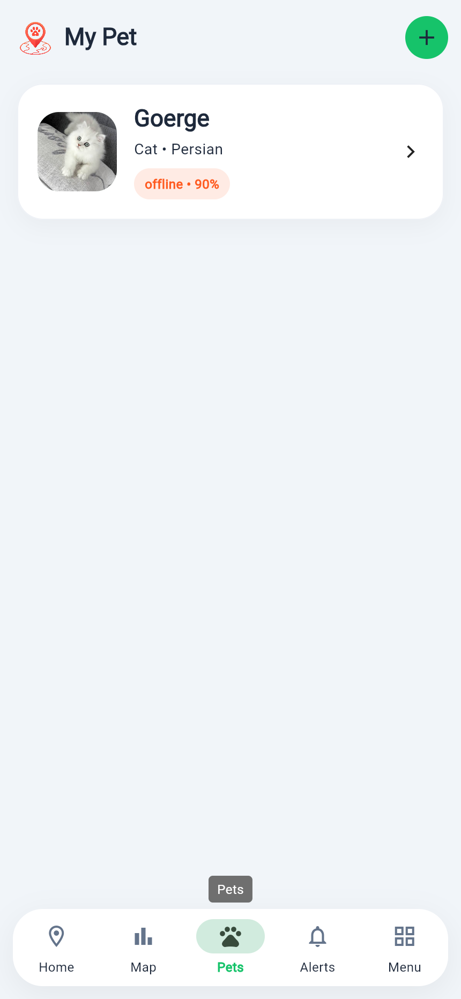
  &nbsp;&nbsp;
  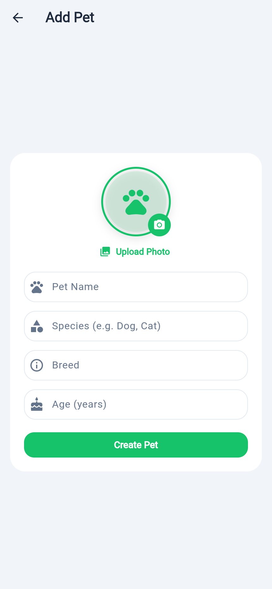
  &nbsp;&nbsp;
  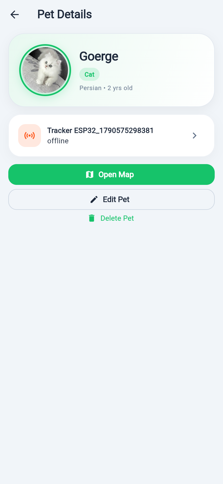
</p>

#### UI Specifications & Manual
1. **My Pet Screen (`08_pets_list.png`):**
   - Displays all registered pets with their custom photo avatar, name (`Goerge`), species/breed (`Cat • Persian`), and live collar battery/status chip (`offline • 90%`).
   - Tapping the green **`+`** button in the top-right AppBar opens the **Add Pet** screen.
2. **Add / Edit Pet Screen with Photo Upload (`09_pet_form_photo_upload.png`):**
   - **Interactive Avatar & Camera Badge:** Tapping the circular avatar or the green camera icon opens a bottom sheet to choose **Pick from Gallery** or **Take a Photo (Camera)**, or **Paste Image URL**.
   - **Upload Photo Button:** Direct one-tap gallery picker (`image_picker`) that resizes and encodes the photo so it renders across Pet Cards, Tracker Details, Safe Zones, and the Live Map Marker.
   - **Form Inputs:** **Pet Name**, **Species (e.g. Dog, Cat)**, **Breed**, and **Age (years)**.
3. **Pet Details Screen (`10_pet_details.png`):**
   - Displays the large circular pet photo, species chip, breed/age summary, linked hardware collar card (`Tracker ESP32_1790575298381`), and quick action buttons: **Open Map**, **Edit Pet**, and **Delete Pet**.

---

### 4.9 Safe Zone Geo-Fencing & Full-Screen Interactive Map Editor
**Files:**
- [`lib/features/geofences/views/geofences_screen.dart`](../pet-tracker-app/lib/features/geofences/views/geofences_screen.dart)
- [`lib/features/geofences/views/geofence_form_screen.dart`](../pet-tracker-app/lib/features/geofences/views/geofence_form_screen.dart)

<p align="center">
  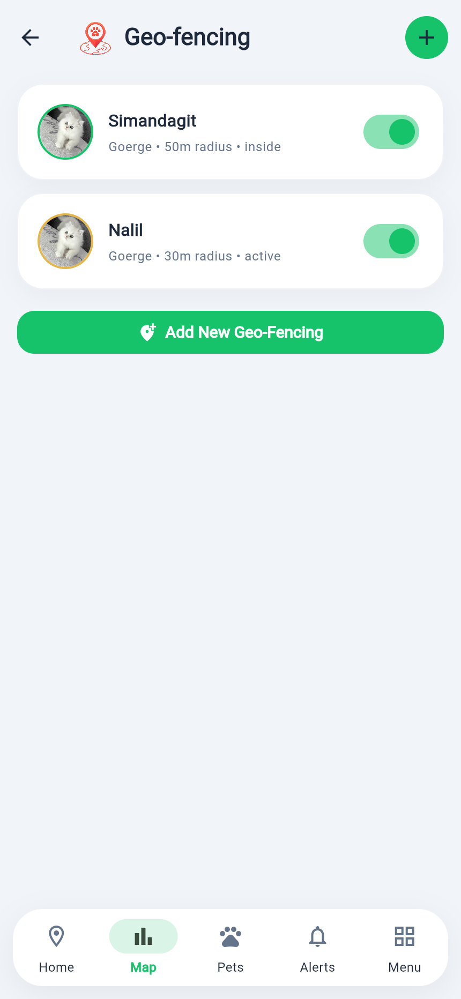
  &nbsp;&nbsp;&nbsp;
  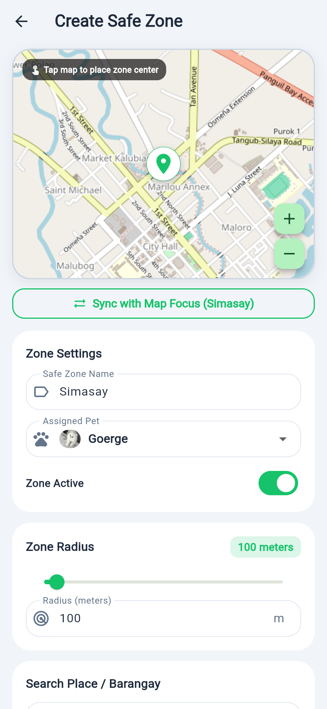
</p>

#### UI Specifications & Manual
1. **Geo-fencing List Screen (`11_geofences_list.png`):**
   - Lists each configured Safe Zone (`Simandagit`, `Nalil`) with the assigned pet's photo avatar, radius in meters (`50m radius`, `30m radius`), current boundary state (`inside` / `outside` / `active`), and an instant enable/disable `Switch`.
   - Includes both a top-right **`+`** button and a full-width **Add New Geo-Fencing** button.
2. **Dedicated Full-Screen Safe Zone Map Editor (`12_geofence_form_editor.png`):**
   - Built as a full screen (`/geofence-form`) instead of a modal sheet.
   - **Live Radius Map Preview:** Displays an interactive map at the top with a green translucent `CircleLayer` showing the exact geographic coverage of the safe zone radius in real time. Tap anywhere on the map to reposition the safe zone center.
   - **One-Tap "Sync with Map Focus" Button:** Positioned directly below the map (`⇄ Sync with Map Focus (Simasay)`), allowing users to instantly snap the safe zone center and default name to their saved Map Focus area for fast setup.
   - **Zone Settings & Radius Slider:** Configure **Safe Zone Name**, **Assigned Pet** (with pet photo preview), **Zone Active** switch, and **Zone Radius** (interactive slider from `10m` to `2,000m` + numeric input in meters).

---

### 4.10 Collar Management, Tracker Details & Assign Pet Workflow
**Files:**
- [`lib/features/devices/views/devices_screen.dart`](../pet-tracker-app/lib/features/devices/views/devices_screen.dart)
- [`lib/features/devices/views/device_details_screen.dart`](../pet-tracker-app/lib/features/devices/views/device_details_screen.dart)

<p align="center">
  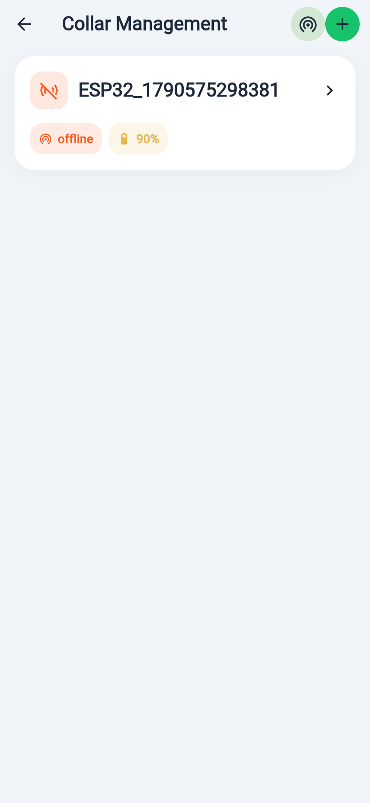
  &nbsp;&nbsp;&nbsp;
  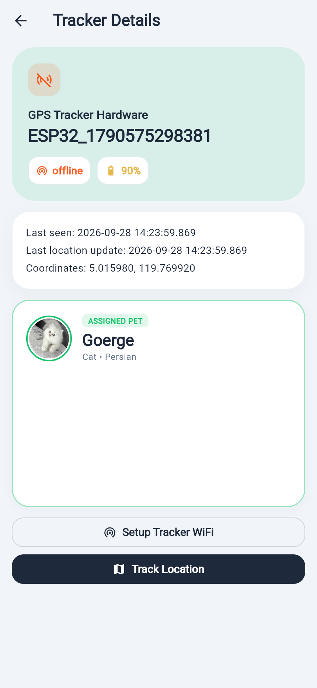
</p>

#### UI Specifications & Manual
1. **Collar Management (`13_devices_list.png`):**
   - Lists all registered ESP32 hardware collars (`ESP32_1790575298381`) with connectivity status (`online` / `offline`) and battery level (`90%`).
   - Top-right AppBar provides quick icons for **Setup Tracker WiFi (`((•))`)** and **Register New Collar (`+`)**.
2. **Tracker Details & Assigned Pet Container (`14_device_details_assign_pet.png`):**
   - **Hardware Status Header:** Displays the tracker ID, connectivity status badge, battery badge, last seen timestamp, and last known GPS coordinates.
   - **Redesigned Assigned Pet Container:** Clean, bordered card displaying the linked pet's photo avatar, green `ASSIGNED PET` pill badge, pet name (`Goerge`), and breed (`Cat • Persian`), along with action buttons to **Change Pet / Assign Tracker to Pet** (opening a pet selector bottom sheet with pet avatars) or **Unassign** the collar.
   - **Bottom Actions:** Direct shortcuts to **Setup Tracker WiFi** and **Track Location**.

---

### 4.11 ESP32 Hardware Wi-Fi Setup (`DeviceWifiSetupScreen`)
**File:** [`lib/features/devices/views/device_wifi_setup_screen.dart`](../pet-tracker-app/lib/features/devices/views/device_wifi_setup_screen.dart)

<p align="center">
  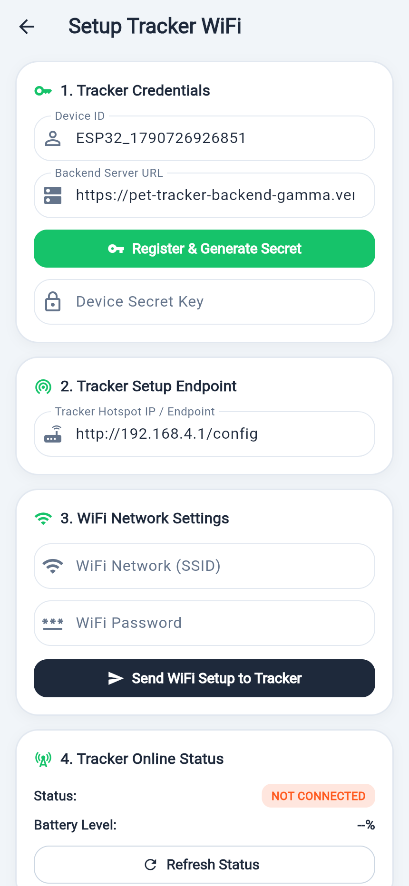
</p>

#### UI Specifications & Manual
- **High-Contrast Adaptive Cards & Concise Field Labels:** Replaces lengthy paragraph instructions with clean, numbered section cards and concise per-field labels that adapt automatically to Light and Dark themes:
  1. **1. Tracker Credentials:** Input or auto-fill `Device ID` and `Backend Server URL` (`https://pet-tracker-backend-gamma.vercel.app`), tap **Register & Generate Secret**, and view/copy the `Device Secret Key`.
  2. **2. Tracker Setup Endpoint:** Configures the ESP32 AP endpoint (`http://192.168.4.1/config`).
  3. **3. WiFi Network Settings:** Enter the 2.4GHz `WiFi Network (SSID)` and `WiFi Password`, then tap **Send WiFi Setup to Tracker** to provision the collar over HTTP.
  4. **4. Tracker Online Status:** Live status indicator (`CONNECTED` / `NOT CONNECTED`), battery readout, and **Refresh Status** button.

---

### 4.12 Activity Status & Real-Time Alerts Inbox (`AlertsScreen`)
**File:** [`lib/features/alerts/views/alerts_screen.dart`](../pet-tracker-app/lib/features/alerts/views/alerts_screen.dart)

<p align="center">
  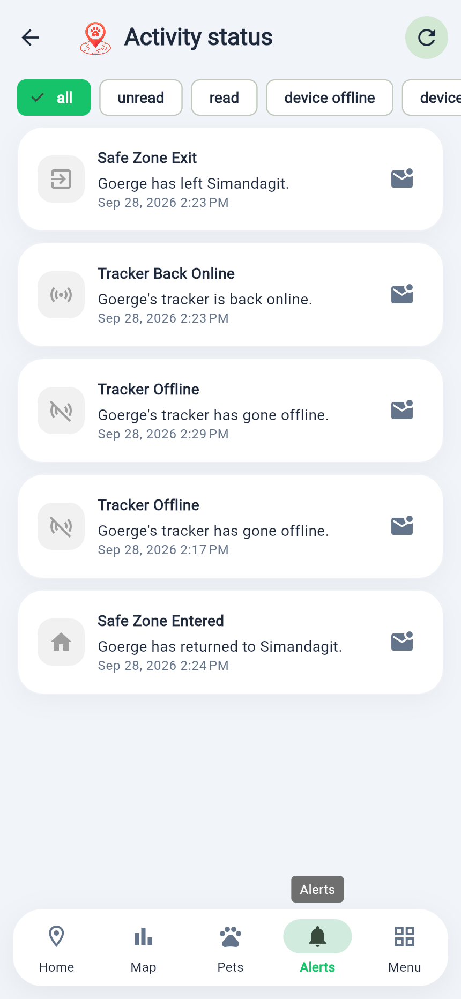
</p>

#### UI Specifications & Manual
- **Filter Chips Bar:** Horizontally scrollable filter bar at the top (`all`, `unread`, `read`, `device offline`, `device online`, `geofence exit`, `geofence enter`, `low battery`).
- **Event Cards:** Displays chronological safety events with distinct icons, titles (`Safe Zone Exit`, `Tracker Back Online`, `Tracker Offline`, `Safe Zone Entered`), human-readable descriptions (`Goerge has left Simandagit.`), timestamps, and one-tap **Mark Read / Unread** envelope buttons.
- **Native Phone Push Notifications:** Backed by `NotificationService` (`lib/core/services/notification_service.dart`), incoming FCM alerts trigger a high-priority system notification banner with sound and vibration on Android (`pet_tracker_alerts` channel) and iOS.

---

### 4.13 Account Menu & Explicit Sign-Out (`ProfileScreen`)
**File:** [`lib/features/profile/views/profile_screen.dart`](../pet-tracker-app/lib/features/profile/views/profile_screen.dart)

<p align="center">
  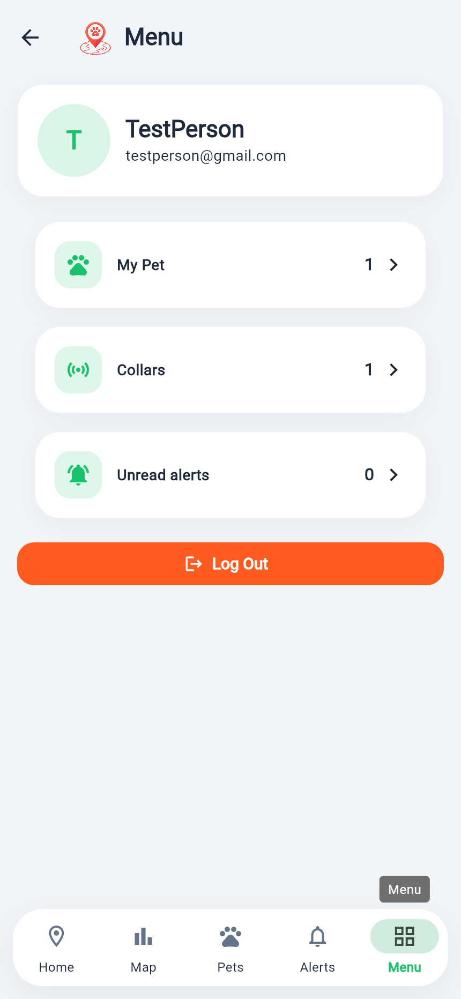
</p>

#### UI Specifications & Manual
- **Owner Profile Card:** Displays the logged-in owner's avatar initial, display name, and email address.
- **Account Summary Shortcuts:** Interactive rows showing counts for **My Pet**, **Collars**, and **Unread alerts**.
- **Explicit Log Out Button:** Tapping **Log Out** unregisters the device's FCM push token, clears the persisted JWT session token from `SharedPreferences`, clears cached state, and returns the user to the **Login Landing Screen**.

---

## 5. Core Technical Architecture & Services

### 5.1 Networking & Persistent Auth Layer ([`ApiClient`](../pet-tracker-app/lib/core/api/api_client.dart))
- **Persistent JWT Storage:** On login/register, `setAuthToken(token)` stores the Bearer token in `SharedPreferences` under `pet_tracker_jwt_token`. On app launch, `AuthController.onInit()` calls `api.initTokenFromStorage()` and verifies the session via `GET /api/v1/auth/me`.
- **Smart GET Caching & Deduplication:** Caches repeatable `GET` requests for 20 seconds (and `/places` lookups for 24 hours) while bypassing cache for live `/devices` and `/location-history` endpoints. Any `POST`, `PATCH`, or `DELETE` request automatically invalidates the cache.
- **Automatic 401 Handling:** If the backend returns `401 Unauthorized`, `ApiClient` clears the stored token and redirects cleanly to `Routes.login`.

### 5.2 Web & Mobile Push Notification Service ([`NotificationService`](../pet-tracker-app/lib/core/services/notification_service.dart))
- **100% Web-Safe Guarding:** Uses `kIsWeb` and `defaultTargetPlatform` (without importing native-only `dart:io`) so the same codebase compiles cleanly to both Android APK and Flutter Web (`build/web`).
- **Android High-Importance Channel:** Initializes `flutter_local_notifications` with channel `pet_tracker_alerts` (`Importance.max`, `Priority.high`, `playSound: true`, `enableVibration: true`) so foreground and background alerts always ring and pop up on the phone.

---

## 6. Setup, Building & Deployment Guide

### 6.1 Local Development
```powershell
cd pet-tracker-app
flutter pub get

# Run on Web (connected to live Vercel backend by default)
flutter run -d chrome

# Run against a local backend on port 8000
flutter run -d chrome --dart-define=PET_TRACKER_API_URL=http://127.0.0.1:8000
```

### 6.2 Building the Android Release APK
```powershell
cd pet-tracker-app
flutter build apk --release --dart-define=PET_TRACKER_API_URL=https://pet-tracker-backend-gamma.vercel.app
Copy-Item -Path "build\app\outputs\flutter-apk\app-release.apk" -Destination "..\pet-tracker-release.apk" -Force
```

### 6.3 Building & Bundling the Flutter Web App for Vercel
The compiled Flutter Web application is bundled into `pet-tracker-backend/web` and mounted at `/` by FastAPI (`app/main.py`) so both the Web UI and `/api/v1/...` endpoints are served from the same Vercel domain:
```powershell
cd pet-tracker-app
flutter build web --release --dart-define=PET_TRACKER_API_URL=https://pet-tracker-backend-gamma.vercel.app

# Copy into backend/web (excluding local canvaskit since Flutter fetches CanvasKit from gstatic CDN)
Remove-Item -Recurse -Force "..\pet-tracker-backend\web" -ErrorAction SilentlyContinue
Copy-Item -Path "build\web" -Destination "..\pet-tracker-backend\web" -Recurse
Remove-Item -Recurse -Force "..\pet-tracker-backend\web\canvaskit" -ErrorAction SilentlyContinue
Remove-Item -Force "..\pet-tracker-backend\web\assets\NOTICES" -ErrorAction SilentlyContinue
```
